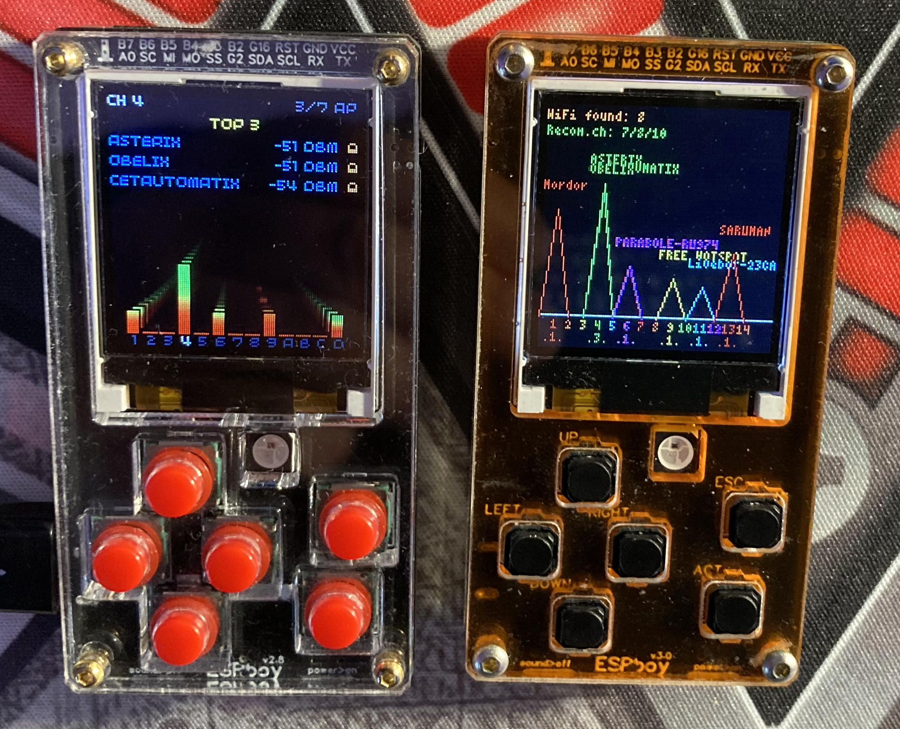

# WiFi Scanner for ESPboy

Inspired by [tobozo's tweet][tweet], I wanted to code a new WiFi network scanner for the ESPboy that presents the collected data in a different form than [the one proposed by Roman][roman] (the ESPboy creator):

The WiFi channel saturation histogram builds by counting the number of access points occupying each channel. The height of the bars computes by the ratio between the number of access points occupying each channel compared to the maximum number observed for all channels.

A color scale indicates the quality of the best-observed signal for each channel. Red indicates a severely weakened signal, while green shows maximum signal quality.

You can view the available access points by scrolling through the channels from left to right. The signal power shows for each access point. A lock indicates that the respective network is protected.

I thank [tobozo][tobozo] for his inspiring experiments and [lovyan03][lovyan03] for his fabulous [LovyanGFX][lovyangfx] graphics driver.

[tweet]:     https://twitter.com/TobozoTagada/status/1469018514702974981
[roman]:     https://github.com/ESPboy-edu/ESPboy_WiFiAnalyzer
[tobozo]:    https://github.com/tobozo
[lovyan03]:  https://github.com/lovyan03
[lovyangfx]: https://github.com/lovyan03/LovyanGFX